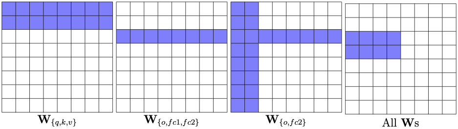

## Introduction


MLPruning is a MultiLevel structured Pruning library for transformer-based models. The library supports the training of BERT models with head/row pruning and block-wise sparsity pruning. Meanwhile, we also incorporate the block sparse MatMul from [Triton](https://github.com/ptillet/triton) to get the real speedup. 

Please see [this paper](xxx) for more details on the MLPruning algorithm.

## For Training
Please refer to the [training folder](https://github.com/yaozhewei/MLPruning/tree/main/training) for more details.

## For Sparse Kernel Inference 
Please refer to the [inference folder](https://github.com/yaozhewei/MLPruning/tree/main/inference) for more details.

## Citation
MLPruning has been developed as part of the following paper. We appreciate it if you would please cite the following paper if you found the library useful for your work:

```text
@article{,
  title={},
  author={},
  journal={},
  year={2021}
}
```
